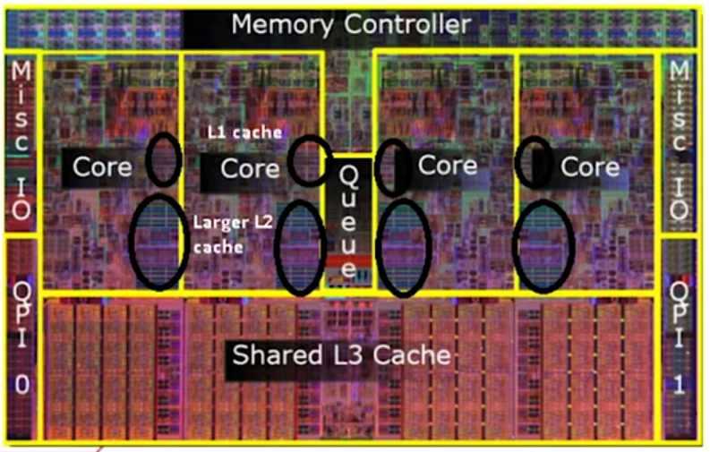

# csharp-cpu-lab (IN PROGRESS)



### Branch Prediction - why sorted array can be faster?

[SO: Why is it faster to process a sorted array than an unsorted array?](https://stackoverflow.com/questions/11227809/why-is-it-faster-to-process-a-sorted-array-than-an-unsorted-array?rq=1)

```
int sum = 0;
foreach (var i in array)
	if (i >= 128)
		sum += i;
return sum;
```

```
        Method |        Mean |    StdDev |      Median |
-------------- |------------ |---------- |------------ |
   SortedArray |  22.7367 us | 0.6702 us |  22.3573 us |
 UnsortedArray | 149.3315 us | 0.6229 us | 149.4772 us |
```

### Cache miss
Cache miss is a state where the data requested for processing by a component or application is not found in the cache memory. 
Each cache miss slows down the overall process because after a cache miss, the central processing unit (CPU) will look for 
a higher level cache, such as L1, L2, L3 and random access memory (RAM) for that data. 
Further, a new entry is created and copied in cache before it can be accessed by the processor.

#### Problem
1024x1024 matrix, Intel Core i5 with L1 cache 128KB, 8-ways, line size of 64. 
Each cache line can hold 8 floats of 8 bytes each.
The critical stride is 128KiB / 8 = 16KiB = 2 rows.

#### About the cache organization
Most caches are organized into lines and sets, i.e: a cache of 8 kb size with a line size of 64 bytes. 
Each line covers 64 consecutive bytes of memory. One kilobyte is 1024 bytes, so we can calculate that the number of lines is 8*1024/64 = 128. 
These lines are organized as 32 sets x 4 ways. This means that a particular memory address cannot be loaded into an arbitrary cache line. 
Only one of the 32 sets can be used, but any of the 4 lines in the set can be used. 
We can calculate which set of cache lines to use for a particular memory address by the formula: (set) = (memory address) / (line size) % (number of sets). 
For example, if we want to read from memory address a= 10000, then we have (set) = (10000 / 64) % 32 = 28. 
This means that amust be read into one of the four cache lines in set number 28.
If the cache always chooses the least recently used cache line then the line that covered the address range from X to Y will be evicted when we read from Z.
Reading again from address X will cause a cache miss. The problem only occurs because the addresses are spaced a multiple of 0x800 apart. 
I will call this distance the critical stride.  Variables whose distance in memory is a multiple of the critical stride will contend for the same cache lines.
The critical stride can be calculated as: (critical stride) = (number of sets) x (line size) = (total cache size) / (number of ways)

#### Cache contentions in large data structures
It takes much more time to transpose the matrix when the size of the matrix is a multiple of the level-1 cache size.
This is because the critical stride is a multiple of the size of a matrix line.
The effect is much more dramatic when contentions occur in the level-2 cache...

A cache works most efficiently when the data are accessed sequentially. 
It works somewhat less efficiently when data are accessed backwards and much less efficiently when data are accessed in a random manner. 
This applies to reading as well as writing data. Multidimensional arrays should be accessed with the last index changing in the innermost loop. 
This reflects the order in which the elements are stored in memory. 

When iterating over arrays, consider CPU cache sizes (L1=64kb, L2=2MB, L3=8MB) and process only X (= L1 size) bytes at a time for best performance gain.
Remember about critical stride. I.E: when acessing memory on Intel Core i7-8550U try not to jump by more than 128KiB / 8-ways = 16KiB to maximize L1 cache.
Usually smallest cache line is 64 bytes, consider structs no larger that this value.

Use BenchmarkDotNet or Hardware Counters like L1c misses/op for diagnostics.

#### Remember
- Fit the L1 cache line (64 bytes) when working with structs
- Keep the data used for one computation close (*array-of-structs*) so that it can be accessed sequentially and loaded into one cache line.
- Remember about critical stride when working with arrays/matrices/streams/buffers 

- https://surana.wordpress.com/2009/01/01/numbers-everyone-should-know/
- https://en.wikipedia.org/wiki/CPU_cache#MULTILEVEL

```
      Method |      Mean |    StdErr |    StdDev |    Median |
------------ |---------- |---------- |---------- |---------- |
 RotateNaive | 8.7432 ms | 0.0400 ms | 0.1385 ms | 8.7250 ms |
 RotateTiled | 2.6486 ms | 0.0265 ms | 0.1092 ms | 2.6250 ms |
```

[Numbers everyone should know](https://surana.wordpress.com/2009/01/01/numbers-everyone-should-know/)


### Cache invalidation - MESI protocol
**There are only two hard things in computer science: cache invalidation and naming things.**

When working with threads where large object is schared among them i.e: array), when one thread modifies block of cached data, all other threads that work with the same copy have to re-read the data from the memory, aka invalidate. This is speed up woth MESI protocol that requires cache to cache transfer on a miss if the block resides in another cache.

When such unintentional cache sharing happens, parallel method should use private memory and then update shared memory when done, or let them modify/access only memory regions that are CL1 size (=~ 64kb) bytes away from each other.

#### Remember
- Design for parallelization

```
                   Method | Parallelism |       Mean |    StdErr |    StdDev |     Median |
------------------------- |------------ |----------- |---------- |---------- |----------- |
      IntegrateSequential |           1 | 46.4865 ms | 0.0313 ms | 0.1130 ms | 46.5153 ms |
 IntegrateParallelSharing |           1 | 46.7902 ms | 0.1595 ms | 0.5752 ms | 46.7739 ms |
 IntegrateParallelPrivate |           1 | 46.3889 ms | 0.0577 ms | 0.2233 ms | 46.3770 ms |
      IntegrateSequential |           2 | 47.0677 ms | 0.2844 ms | 1.1014 ms | 46.7873 ms |
 IntegrateParallelSharing |           2 | 36.1801 ms | 0.4011 ms | 1.5533 ms | 35.7176 ms |
 IntegrateParallelPrivate |           2 | 26.1333 ms | 0.2574 ms | 1.5229 ms | 25.8960 ms |
      IntegrateSequential |           4 | 46.4568 ms | 0.0470 ms | 0.1820 ms | 46.4738 ms |
 IntegrateParallelSharing |           4 | 32.5735 ms | 0.0972 ms | 0.3638 ms | 32.5975 ms |
 IntegrateParallelPrivate |           4 | 24.0229 ms | 0.0677 ms | 0.2531 ms | 23.9731 ms |
```

### ILP vs Parallel vs SIMD
- ILP option doesn't help because compiler has to do boundary checks for us.
- Parallel is not fastest because of data sharing (cache invalidation).
- Considering *single instruction, multiple data (SIMD)* does bring best performance boost when working with arrays. This can be achieved via `System.Numerics.Vectorization.Vector<T>` class in C#.

#### Remember
- Avoid nonsequential access
- Consider SIMD operations (Vector<T>)

```
         Method |          Mean |     StdErr |     StdDev |        Median |
--------------- |-------------- |----------- |----------- |-------------- |
    MinMaxNaive |   603.0989 us |  5.2490 us | 20.3293 us |   597.3966 us |
      MinMaxILP | 1,025.9282 us | 10.4831 us | 54.4718 us | 1,024.1082 us |
     MinMaxSimd |   160.7848 us |  1.5912 us |  9.2784 us |   158.5755 us |
 MinMaxParallel |   416.3257 us |  2.1792 us |  8.4402 us |   416.8833 us |
```

### AoS vs SoA
This is strongly connected to **Data Oriented Programming**. When working with arrays of structs, consider switching to struct of arrays instead, that can benefit from vectorization (SIMD instructions) and sequential data access. 
